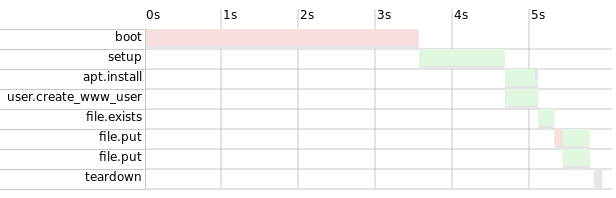

.. nuka documentation master file, created by
   sphinx-quickstart on Wed Dec 28 12:30:49 2016.
   You can adapt this file completely to your liking, but it should at least
   contain the root `toctree` directive.

================================
nuka
================================

.. image:: https://travis-ci.org/bearstech/nuka.png?branch=master
  :target: https://travis-ci.org/bearstech/nuka

Because ops can dev.

nuka is a provisionning tool focused on performance. It massively use asyncio
and ssh. It's compatible with docker vagrant and apache-libcloud.

Quickstart
==========

Install nuka (See :doc:`install` for detailled steps)::

    $ pip install "nuka[full]"

Then start a script:

.. literalinclude:: ../examples/quickstart.py

Run it using::

    $ chmod +x your_file.py
    $ ./your_file.py -v

The first run will be slow because we'll pull the docker image.
The next run will take ~1s.

Get some help::

    $ ./your_file.py -h

Look at the generated gantt of your deployement::

    $ firefox .nuka/reports/your_file_gantt.html

You'll get a dynamic report like this screenshot:

Index
=====

.. toctree::
   :maxdepth: 1
   :glob:

   install
   api
   tasks
   custom_tasks
   arch

Indices and tables
==================

* :ref:`genindex`
* :ref:`modindex`
* :ref:`search`
